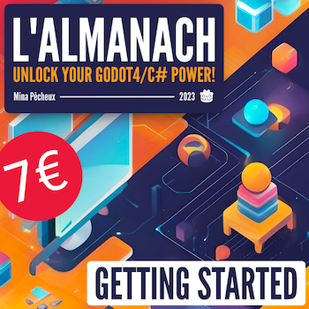
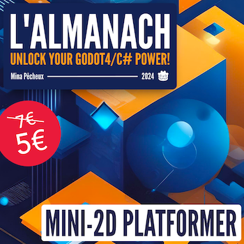

# [Godot/C#] Tutorials

**Mina Pêcheux - Since November 2022**

This repo contains the code and assets for the various Godot/C# tutorials I published as videos and text articles on YouTube/Medium.

✨ Amazing **asset packs** by [Kenney](https://kenney.nl/) :)

=========================

⚠️ **WARNING** ⚠️

I re-updated this repo to work with Godot 4. Tutorials 01 to 05 were initially made with Godot 3 and the video/text versions still refer to this old version, but the code and the assets in this Github repo are made for Godot 4.

=========================

## 📚 L'Almanach

If you'd like to get those tutorials in ebook format and help support my work for a low price, you can check out the *L'Almanach* series on Gumroad!

    

         
        <b>Getting Started</b>: 3 tutorials + 1 full mini-game for complete beginners
    

    

         
        <b>Mini-2D Platformer</b>: 3 tutorials + 1 full mini-game to learn the basics of 2D in Godot
    

 
=========================

## 🕹 Mini-games

If you're more of a hands-on learner and you'd like to explore a complete mini-game to discover Godot 4/C# concepts, this section is for you! Here you'll find the list of the little games in this repo (in the [MiniGames](/MiniGames/) folder):

### Tic-tac-toe

> [See the files](/MiniGames/TicTacToe/)

This re-implementation of the classical board game will take you through the fundamentals of creating a game in Godot 4 with C# scripting. You'll see how to design a user interface, code up some logic to interact with those UI elements and update them dynamically, and other beginner Godot notions.

### Mini-2D platformer

> [See the files](/MiniGames/Mini2DPlatformer/)

A simple 2D side-scroller platformer à-la Mario with a complete level loop, some shiny coins to collect, dangerous slimes moving around and a basic user interface to keep track of the player state.

=========================

Also, as of now, the repo contains the code and assets for the following tutorials:

## 00. Your first time in Godot?

Curious about the fundamentals of this free open-source game engine? This little tutorial will show you how to install and setup the software, plus how to make a little demo of a bouncy ball with some physics in just 15'! :)

- Watch on YouTube: [in English 🇬🇧](https://www.youtube.com/watch?v=N3XaN_R38Jc), [in French 🇫🇷](https://www.youtube.com/watch?v=pKjhV6HPPU8)
- Read on [Medium](https://mina-pecheux.medium.com/a-short-beginners-guide-to-discovering-godot-d1bbae89d26a)
- See the files [in the repo](/00-Basic/)

## 01. Creating a basic waypoints system

- Watch on YouTube: [in English 🇬🇧](https://www.youtube.com/watch?v=EZINSDERTW8), [in French 🇫🇷](https://www.youtube.com/watch?v=vvC3uiIkIBQ)
- Read on [Medium](https://mina-pecheux.medium.com/creating-a-waypoints-system-in-godot-c-faac2a44924d)
- See the files [in the repo](/01-Waypoints)

## 02. Making a basic 2D tower defense game prototype

Discover how to implement some base mechanics for a 2D tower defense game in this 30' tutorial. The pirate ships are attacking, and we need to place some defences on the islands to defend the nearby city! :)

- Watch on YouTube: [in English 🇬🇧](https://www.youtube.com/watch?v=N0LHUOcKXAQ), [in French 🇫🇷](https://www.youtube.com/watch?v=_v_EZRkoJ68)
- Read on [Medium](https://mina-pecheux.medium.com/making-a-simple-2d-tower-defense-game-in-godot-c-a70a5a9d2bf3)
- See the files [in the repo](/02-TDBase)

## 03. Creating & loading custom resource types

- Watch on YouTube: [in English 🇬🇧](https://www.youtube.com/watch?v=yUmY3Gi3z5U), [in French 🇫🇷](https://www.youtube.com/watch?v=myJBzY7bu8k)
- Read on [Medium](https://medium.com/p/creating-loading-custom-data-in-godot-c-ff14de97bc57)
- See the files [in the repo](/03-TDLoadData)

## 04. Implementing a point-and-click navigation logic

- Watch on YouTube: [in English 🇬🇧](https://www.youtube.com/watch?v=ZnM_nXSoXQ0), [in French 🇫🇷](https://www.youtube.com/watch?v=nUvPq5sanJc)
- Read on [Medium](https://mina-pecheux.medium.com/implementing-a-point-and-click-navigation-in-godot-c-166e253b2b45)
- See the files [in the repo](/04-RTSUnitNavigation/)

## 05. Implementing a basic mouse follow logic

- Watch on YouTube: [in English 🇬🇧](https://youtu.be/FuuxC4G60lU), [in French 🇫🇷](https://youtu.be/3_7Z0IIT8Rg)
- Read on [Medium](https://mina-pecheux.medium.com/implementing-a-basic-mouse-follow-logic-in-godot-c-ae51f0859a95)
- See the files [in the repo](/05-MouseFollow/)

## 06. The power of 2D Tilemaps

- Watch on YouTube: [in English 🇬🇧](https://www.youtube.com/watch?v=DhD8ltK3NWo), [in French 🇫🇷](https://www.youtube.com/watch?v=vFhg3nwwsWw)
- Read on [Medium](https://mina-pecheux.medium.com/the-power-of-godots-2d-tilemaps-997dd2293e82)
- See the files [in the repo](/06-2DTilemaps/)

## 07. Implementing a 2D character controller

- Watch on YouTube: [in English 🇬🇧](https://youtu.be/b7UNuZ-s_Kg), [in French 🇫🇷](https://www.youtube.com/watch?v=aa03rwqeAtA)
- Read on [Medium](https://mina-pecheux.medium.com/implementing-a-simple-2d-character-controller-godot-4-c-9f4fe4f24288)
- See the files [in the repo](/07-2DCharacterController/)

## 08. Making a basic finite state machine

- Watch on YouTube: [in English 🇬🇧](https://www.youtube.com/watch?v=Kcg1SEgDqyk)
- Read on [Medium](https://mina-pecheux.medium.com/making-a-basic-finite-state-machine-godot4-c-fe5ccc0e8cd7)
- See the files [in the repo](/08-FSM/)

## 09. Creating a simple but full game loop

- Watch on YouTube: [in English 🇬🇧](https://www.youtube.com/watch?v=_hkSCSvk4_4)
- Read on [Medium](https://medium.com/p/4d5586c67f79)
- See the files [in the repo](/09-GameLoop/)

## 10. Instantiate & move random 3D units!

- Watch on YouTube: [in English 🇬🇧](https://www.youtube.com/watch?v=v7EUsWQKRko)
- Read on [Medium](https://medium.com/p/9f4fe4f24288)
- See the files [in the repo](/10-RandomUnits/)

## 11. Learning the basics of input actions

- Watch on YouTube: [in English 🇬🇧](https://youtu.be/uZvDAgXpPOU)
- Read on [Medium](https://mina-pecheux.medium.com/learning-the-basics-of-input-actions-godot-4-c-42458db5d1fc)
- See the files [in the repo](/11-InputActions/)

## 12. Using animations for a basic chest system

- Watch on YouTube: [in English 🇬🇧](https://youtu.be/dp-BZMYfPdM)
- Read on [Medium](https://mina-pecheux.medium.com/using-animations-to-make-a-simple-chest-system-godot-4-c-34a66747946e)
- See the files [in the repo](/12-Animations/)

## 13. Going further with 2D Tilemaps

- Watch on YouTube: [in English 🇬🇧](https://youtu.be/HLGHiY7lw5A)
- Read on [Medium](https://medium.com/p/4c77ad6445ad)
- See the files [in the repo](/13-Tilemaps2/)

## 14. Loading resources at runtime in C#...

- Watch on YouTube: [in English 🇬🇧](https://youtu.be/_m4L36SfijA)
- Read on [Medium](https://medium.com/p/2dc87ad97c89)
- See the files [in the repo](/14-LoadResources/)

## 15. Using mask culling & visibility layers

- Watch on YouTube: [in English 🇬🇧](https://youtu.be/UqQyBv4htqw)
- Read on [Medium](https://mina-pecheux.medium.com/using-mask-culling-visibility-layers-godot-4-c-7d3b8b0415d5)
- See the files [in the repo](/15-VisibilityLayers/)

## 16. Spawning 2D enemy waves

- Watch on YouTube: [in English 🇬🇧](https://www.youtube.com/watch?v=GA024FqDzV0)
- Read on [Medium](https://mina-pecheux.medium.com/spawning-2d-enemy-waves-godot-4-c-509f6048d001)
- See the files [in the repo](/16-EnemyWaves/)

## 17. Setting up basic JRPG-like dialogues

- Watch on YouTube: [in English 🇬🇧](https://www.youtube.com/watch?v=L-OaaiJk22w)
- Read on [Medium](https://medium.com/p/1574eb28e548)
- See the files [in the repo](/17-BasicDialogue/)

## 18. Creating a pause overlay screen

- Watch on YouTube: [in English 🇬🇧](https://www.youtube.com/watch?v=-4jVIKix-yk)
- Read on [Medium](https://medium.com/p/1d291f6aad26)
- See the files [in the repo](/18-PauseScreen/)

## 19. Setting up an animated 3D character controller

- Watch on YouTube: [in English 🇬🇧](https://youtu.be/cliZF3uPkHM)
- Read on [Medium](https://medium.com/p/ef1c9cd3ddcc)
- See the files [in the repo](/19-Animated3DCharacter/)

## 20. Discovering Godot's pseudolocalisation

- Watch on YouTube: [in English 🇬🇧](https://www.youtube.com/watch?v=cnH4SgqizJA)
- Read on [Medium](https://mina-pecheux.medium.com/discovering-godots-pseudolocalisation-godot-4-c-232dfaafd3c9)
- See the files [in the repo](/20-Pseudolocalisation/)

## 21. Implementing a basic 3D moving platform

- Watch on YouTube: [in English 🇬🇧](https://youtu.be/5KvVLI4-3G0)
- Read on [Medium](https://mina-pecheux.medium.com/implementing-a-basic-moving-platform-godot-4-c-30e072619b16)
- See the files [in the repo](/21-MovingPlatform/)

## 22. Creating a basic 3rd person camera

- Watch on YouTube: [in English 🇬🇧](https://www.youtube.com/watch?v=dWalA9muY3s)
- Read on [Medium](https://medium.com/codex/creating-a-simple-3rd-person-camera-godot-4-28d80f08551c)
- See the files [in the repo](/22-3rdPersonCamera/)

## 23. Setting up a 3D minimap

- Watch on YouTube: [in English 🇬🇧](https://www.youtube.com/watch?v=LXzQXoheXAA)
- Read on [Medium](https://mina-pecheux.medium.com/setting-up-a-3d-minimap-02244d030390)
- See the files [in the repo](/23-3DMinimap/)

## 24. Implementing a 2D point-and-click navigation system

- Watch on YouTube: [in English 🇬🇧](https://youtu.be/WEAuszjRDHY)
- Read on [Medium](https://mina-pecheux.medium.com/implementing-2d-point-and-click-navigation-godot-4-c-1735aaef2089)
- See the files [in the repo](/24-2DNav/)

